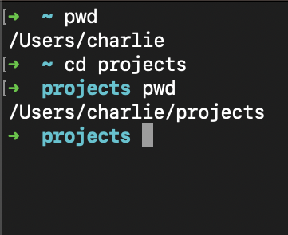
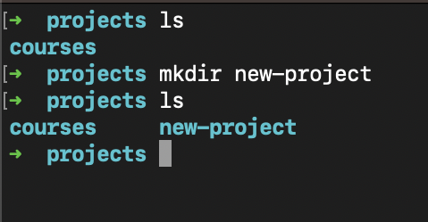
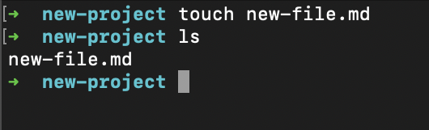
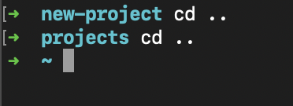
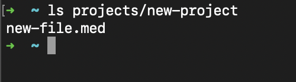

# Command Line Basics

## Definition

A **command line** (aka **terminal**) is a text based interface with a computer's system. This can be used instead of a graphical user interface in order to execute more complex commands and interact more directly with the computer's operating system. It utilizes a basic command structure similar to coding.

## Directories

Most OS's use a hierarchical system of directories and folders. Think of it as a complex Russian nesting doll. A folder can have a folder inside of it infinitely.

There is a root directory, and inside the root directory are folders that organize files and sub-folders by type and purpose. Common folders are *'Downloads'*, *'Documents'*, *'Applications'* etc

### Directory Commands

- `pwd`: "Print Working Directory". Typing `pwd` prints your current location within the computer directory.
- `ls`: "List". Typing `ls` will list the files and folders within your current location in the computer directory. *Example: typing `ls` in **Downloads** will list all files and folders saved in **Downloads***

  - `-l` is an argument which can be added to `ls` to show more information on the files and folders listed, such as the permissions and author of a file.
- `cd`: "Change "Directory". This allows you to change locations in you computer directory. Typing only 'cd' without an argument will bring you to the root directory. A file or folder must be typed after it to change to a different location.
    - `..` is an argument that allows you to go to the directory above you in the hierarchy. adding more '.'s to it will make you go more steps backwards
- `mkdir`: "Make Directory". Typing `mkdir` will allow you to create a new folder in your location within the computer's directory. The name of the folder must be typed afterwards as an argument.
- `touch`: "Touch".  This allows you to create a new file. The name of the file, with its intended extension, must be typed afterwards. You may also note the file's location by adding the desired directory before the name.

### Commands in action

- In this image the first command given is `pwd`. It prints out the location \("/Users/charlie"). The secound command given is `cd projects`, nothing is printed but by then typing the command `pwd` it shows that it changed my location to "/Users/charlie/projects/" 

  

- Initially, `ls` shows that the only folder in the "projects" directory is "courses". But the next command, `mkdir new-project` creates another folder called "new-project". This is shown when the second `ls` command elicits a new list that includs both "courses" and "new-project".
  
  

- While in the "/Users/charlie/projects/new-project" directory, the command `touch new-file.md` is given. Using `ls`, it is shown that the command created a new file called "new-file.md" within the "new-project" directory.

  

- In this image, I start out located in the "/Users/charlie/projects/new-project" directory. You can tell this because of the "new-project" listed in blue before the prompt. Entering the command `cd` with the `..` argument moved me to the "/Users/charlie/projects" directory, one directory up from "new-projects". Typing `cd ..` again led me to the "/Users/charlie" directory.

  

- In this last example, by typing the exact directory I wanted to see as an argument to the `ls` command, it listed all the files in the desired directory without me having to be located within it.

  
